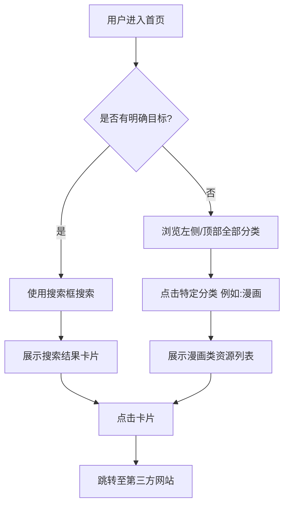

# 产品需求文档 (PRD) - 工具资源导航站

| 文档版本 | V1.0 |
| :--- | :--- |
| **文档状态** | 草稿 |
| **项目名称** | (暂定名) X-Nav 资源导航 |
| **主要功能** | 针对娱乐、ACG、工具类的网址收集与跳转 |
| **参考竞品** | 硬核指南 (yinghezhinan.com) |

---

## 1. 项目背景与目标

### 1.1 项目背景
互联网资源繁杂，用户在寻找特定领域（如二次元、游戏资源、在线工具）的高质量网站时，往往面临信息过载或链接失效的问题。建立一个经过人工筛选、分类清晰的导航站，能极大提升用户的检索效率。

### 1.2 产品目标
*   **核心价值**：提供“即搜即用、分类精准”的优质网址入口。
*   **设计风格**：参考 *yinghezhinan*，保持界面清爽、无广告干扰、加载速度快。
*   **初始内容**：重点覆盖 **娱乐、漫画、音乐、游戏、动漫** 五大核心板块。

---

## 2. 用户画像 (User Persona)

| 用户类型 | 特征描述 | 核心诉求 |
| :--- | :--- | :--- |
| **ACG 爱好者** | 喜欢追番、看漫画、找游戏资源 | 寻找免费、高清、更新快的资源站点。 |
| **工具使用者** | 需要在线格式转换、下载器等工具 | 快速找到能解决问题的工具，不想看广告。 |
| **闲逛摸鱼党** | 工作/学习间隙寻找娱乐内容 | 浏览“娱乐”板块，发现有趣的新网站。 |

---

## 3. 功能需求说明 (Functional Requirements)

### 3.1 前端用户侧 (Client Side)

#### 3.1.1 首页布局
*   **侧边栏/顶部导航**：固定显示一级分类（娱乐、漫画、音乐、游戏、动漫、其他工具）。
*   **搜索栏**：
    *   位于首屏中心醒目位置。
    *   支持站内资源搜索（搜索网站名称、描述标签）。
    *   （可选）聚合搜索功能（如集成 Google/Baidu 切换）。
*   **推荐/置顶区**：展示“站长推荐”或“本周热门”的 4-8 个工具卡片。

#### 3.1.2 资源卡片列表（核心）
*   **展示形式**：网格状卡片布局（Grid Layout）。
*   **卡片内容**：
    *   **图标 (Favicon)**：自动抓取或手动上传。
    *   **网站名称**：清晰加粗。
    *   **简短描述**：一句话介绍该网站的核心用途（如：“免费在线观看高清动漫”）。
    *   **标签 (Tag)**：例如 `#免费` `#需翻墙` `#App`。
*   **直达链接**：点击卡片新窗口打开目标网站。

#### 3.1.3 具体分类规划 (根据你的需求)
1.  **娱乐**：影视站、搞笑社区、短视频下载、直播聚合。
2.  **漫画**：在线漫画阅读器、生肉资源站、汉化组博客。
3.  **音乐**：无损音乐下载、白噪音网站、在线乐器、格式转换。
4.  **游戏**：Steam数据库、游戏Mod站、怀旧小游戏、攻略WIKI。
5.  **动漫**：番剧索引、Animate资讯、壁纸站。

#### 3.1.4 用户反馈/收录申请
*   **功能**：用户可以提交新的网站链接给管理员。
*   **表单项**：网站名称、网址、分类建议、推荐理由。

### 3.2 后台管理侧 (Admin Panel)

#### 3.2.1 链接管理
*   **增删改查**：管理员可手动添加网站，编辑标题、描述、图标、所属分类。
*   **排序功能**：支持拖拽排序或按权重排序（决定谁排在前面）。
*   **链接检测**：(进阶) 后台一键检测死链，标记无法访问的网站。

#### 3.2.2 分类管理
*   支持自定义分类及图标。
*   支持二级分类（例如：“游戏”下分为“单机”、“手游”、“插件”）。

#### 3.2.3 数据统计
*   统计各链接的点击量（Click Count），以便了解哪些资源最受欢迎，从而调整推荐位。

---

## 4. 非功能性需求 (Non-functional Requirements)

1.  **性能 (Performance)**：
    *   首屏加载时间需控制在 1.5秒以内（导航站必须快）。
    *   图标 (Icons) 需使用懒加载 (Lazy Load) 技术。
2.  **兼容性 (Compatibility)**：
    *   **响应式设计 (Responsive)**：必须完美适配 PC 端和移动端（手机访问导航站的场景非常多）。
    *   支持暗黑模式 (Dark Mode)，符合极客/二次元群体喜好。
3.  **SEO (搜索引擎优化)**：
    *   每个分类页需要有独立的 Title 和 Description。
    *   URL 结构需伪静态化（例如 `domain.com/category/game`）。

---

## 5. 页面流程图 (Flowchart)简述

---

## 6. 开发技术栈建议 (仅供参考)

鉴于这是一个轻量级导航站，建议采用以下技术栈以保证开发效率和性能：

*   **前端**：Vue.js / React / Next.js (利于SEO)。
*   **UI 框架**：Tailwind CSS (构建参考站那种简洁风格非常快) 或 Element Plus。
*   **已有开源方案**：如果不打算从零开发，可以基于开源项目二次开发，例如：
    *   *WebStack-Vue* (非常经典的导航站开源主题)
    *   *OneNav* (功能强大的PHP导航系统)

---

## 7. 初始内容运营策略

作为产品规划的一部分，内容填充是关键：

1.  **种子数据**：前期需要手动搜集约 50-100 个高质量网站，确保五大分类下都不为空。
2.  **描述优化**：不要只写网站名，务必加上“XSimple 推荐语”，例如：“P站镜像，加载速度快”，增加用户点击欲望。
3.  **失效维护**：每周检查一次链接有效性。

