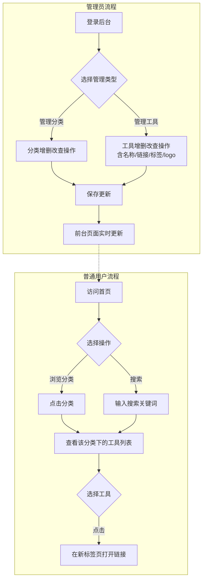

# 产品需求文档：工具资源导航站 - V2.0

## 1. 综述 (Overview)

### 1.1 项目背景与核心问题

互联网资源繁杂，用户在寻找特定领域（如二次元、游戏资源、在线工具）的高质量网站时，往往面临信息过载或链接失效的问题。建立一个经过人工筛选、分类清晰的导航站，能极大提升用户的检索效率。

**核心问题**：
- 用户难以快速找到特定领域的优质工具网站
- 缺乏统一分类和筛选机制
- 链接失效问题无人维护

**产品定位**：提供"即搜即用、分类精准"的优质网址入口，设计风格清爽、无广告干扰、加载速度快。

**参考竞品**：硬核指南 (yinghezhinan.com)

### 1.2 核心业务流程 / 用户旅程地图

1. **阶段一：基础数据管理** - 管理员维护分类和工具数据，确保内容质量和时效性
2. **阶段二：用户浏览功能** - 普通用户通过分类浏览、搜索等方式找到目标工具
3. **阶段三：管理员后台** - 管理员登录后台进行分类和工具的增删改查操作

### 1.3 Mermaid 图（流程/状态/时序）

> 说明：Mermaid 图用于"需求对齐"，避免歧义；避免写成技术实现细节（不要写 API 路径、字段、HTTP code、框架/库）。

#### 1.3.1 用户操作流（必填）



---

## 2. 用户故事详述 (User Stories)

### 阶段一：基础数据管理

---

#### **US-01: 作为管理员，我希望管理分类（增删改查），以便于组织和维护网站的分类结构。**

*   **价值陈述 (Value Statement)**:
    *   **作为** 管理员
    *   **我希望** 能够添加、编辑、删除分类，并支持拖拽排序
    *   **以便于** 灵活地组织网站的分类结构，确保分类逻辑清晰合理

*   **业务规则与逻辑 (Business Logic)**:
    1.  **前置条件**: 管理员已登录系统并进入分类管理页面
    2.  **操作流程 (Happy Path)**:
        *   **创建分类**: 输入分类名称，点击"创建"，系统校验名称是否重复，校验通过后创建成功
        *   **编辑分类**: 修改分类名称，点击"保存"，系统校验名称是否与其他分类重复
        *   **删除分类**: 点击删除按钮，弹出二次确认对话框，确认后执行删除，该分类下的所有工具也一并删除（级联删除）
        *   **拖拽排序**: 拖拽分类卡片调整位置，松开后立即保存新顺序
    3.  **异常处理 (Error Handling)**:
        *   分类名称重复时，系统拒绝操作并提示"分类名称已存在"
        *   删除已有工具的分类时，弹出提示"确定要删除该分类吗？删除后该分类下的所有工具也将被删除"
        *   分类数量达到上限（20个）时，拒绝创建新分类并提示"分类数量已达上限"
    4.  **性能与容量提示**:
        *   分类名称长度限制：最长20个字符
        *   分类数量上限：20个
        *   不允许分类名称重复
        *   允许纯空格名称（建议前端校验）
        *   允许特殊字符（包括emoji、@、#、$等）

*   **验收标准 (Acceptance Criteria)**:
    *   **场景1: 成功创建分类**
        *   **GIVEN** 我登录了管理后台
        *   **WHEN** 我输入分类名称"游戏"并点击"创建"
        *   **THEN** 系统应提示"分类创建成功"，分类列表中显示新创建的分类
    *   **场景2: 分类名称重复**
        *   **GIVEN** 已存在分类"游戏"
        *   **WHEN** 我尝试创建同名分类"游戏"
        *   **THEN** 系统应拒绝创建并提示"分类名称已存在"
    *   **场景3: 级联删除分类**
        *   **GIVEN** 分类"游戏"下有5个工具
        *   **WHEN** 我删除"游戏"分类并确认
        *   **THEN** 系统应删除该分类及其下的所有5个工具
    *   **场景4: 拖拽排序**
        *   **GIVEN** 有3个分类按顺序排列
        *   **WHEN** 我将第3个分类拖拽到第1个位置
        *   **THEN** 前台首页的分类展示顺序应实时更新为新顺序

---

#### **US-02: 作为管理员，我希望管理工具（增删改查），以便于维护网站的工具资源。**

*   **价值陈述 (Value Statement)**:
    *   **作为** 管理员
    *   **我希望** 能够添加、编辑、删除工具，记录名称、链接、标签、logo等信息
    *   **以便于** 及时更新和维护网站上的工具资源，确保链接有效、信息准确

*   **业务规则与逻辑 (Business Logic)**:
    1.  **前置条件**: 管理员已登录系统；系统已有可用的分类
    2.  **操作流程 (Happy Path)**:
        *   **创建工具**: 选择所属分类，输入工具名称、链接、标签，上传logo图片，点击"创建"
        *   **编辑工具**: 修改工具的名称、链接、标签、logo或所属分类，点击"保存"
        *   **删除工具**: 点击删除按钮，弹出二次确认对话框，确认后删除工具
        *   **工具排序**: 在分类下拖拽工具卡片调整顺序，松开后立即保存
    3.  **异常处理 (Error Handling)**:
        *   链接格式不合法时，提示"请输入有效的网址"
        *   logo图片超过大小限制时，提示"图片大小不能超过2MB"
        *   删除工具时，弹出提示"确定要删除该工具吗？"
    4.  **性能与容量提示**:
        *   工具名称长度限制：最长50个字符
        *   工具描述长度限制：最长200个字符
        *   logo图片大小限制：最大2MB，支持 jpg/png 格式
        *   标签数量限制：最多5个，每个标签最长20个字符
        *   单个分类下工具数量上限：建议不超过50个（为性能考虑）

*   **验收标准 (Acceptance Criteria)**:
    *   **场景1: 成功创建工具**
        *   **GIVEN** 我登录了管理后台
        *   **WHEN** 我选择分类"游戏"，输入名称"SteamDB"、链接"https://steamdb.info/"、标签"#免费 #数据库"，上传logo后点击"创建"
        *   **THEN** 系统应提示"工具创建成功"，工具列表中显示新创建的工具
    *   **场景2: 链接格式错误**
        *   **GIVEN** 我正在创建工具
        *   **WHEN** 我输入链接"not-a-url"
        *   **THEN** 系统应提示"请输入有效的网址"，禁用创建按钮
    *   **场景3: 修改工具所属分类**
        *   **GIVEN** 工具"SteamDB"属于"游戏"分类
        *   **WHEN** 我将其修改为属于"工具"分类并保存
        *   **THEN** 前台页面中，该工具应显示在"工具"分类下，"游戏"分类下不再显示
    *   **场景4: 工具排序**
        *   **GIVEN** "游戏"分类下有5个工具
        *   **WHEN** 我将第5个工具拖拽到第1个位置
        *   **THEN** 前台"游戏"分类的工具列表应实时更新为新顺序

---

### 阶段二：用户浏览功能

---

#### **US-03: 作为普通用户，我希望在首页看到分类列表，以便于快速选择感兴趣的领域。**

*   **价值陈述 (Value Statement)**:
    *   **作为** 普通用户
    *   **我希望** 首页展示所有分类列表
    *   **以便于** 快速了解网站包含的资源类型并选择感兴趣的领域

*   **业务规则与逻辑 (Business Logic)**:
    1.  **前置条件**: 用户访问网站首页
    2.  **操作流程 (Happy Path)**:
        *   首页展示所有分类（按管理员设置的顺序）
        *   每个分类显示分类名称
        *   点击分类名称，跳转到该分类的工具列表页
    3.  **异常处理 (Error Handling)**:
        *   如果某个分类下没有工具，分类仍然显示，但点击后显示"该分类下暂无工具"

*   **验收标准 (Acceptance Criteria)**:
    *   **场景1: 展示分类列表**
        *   **GIVEN** 系统有5个分类
        *   **WHEN** 用户访问首页
        *   **THEN** 首页应显示全部5个分类，顺序与后台设置一致

---

*   **页面布局线框图 (ASCII Wireframe)**:

```text
+-------------------------------------------------------------+
|                      工具资源导航站                          |
+-------------------------------------------------------------+
|  🔍 搜索工具...                                             |
+-------------------------------------------------------------+
|  分类列表                   |  热门推荐                    |
|                             |                              |
|  🎬 影视 (12)              |  [icon] SteamDB              |
|  📚 漫画 (8)               |  游戏数据库平台              |
|                             |  #免费 #数据库                |
|  🎨 动漫 (15)              |                              |
|  📖 小说 (5)               |  [icon] Pixiv                |
|  🤖 AI工具 (20)            |  艺术创作平台                |
|                             |  #创作 #社交                 |
|  🎮 游戏 (10)              |                              |
|                             +------------------------------+
+-------------------------------------------------------------+
```

---

#### **US-04: 作为普通用户，我希望按分类查看工具列表，以便于找到该领域的所有工具。**

*   **价值陈述 (Value Statement)**:
    *   **作为** 普通用户
    *   **我希望** 点击分类后查看该分类下的所有工具
    *   **以便于** 浏览该领域的完整工具集合

*   **业务规则与逻辑 (Business Logic)**:
    1.  **前置条件**: 用户已选择某个分类
    2.  **操作流程 (Happy Path)**:
        *   显示该分类下的所有工具卡片（按管理员设置的顺序）
        *   每个工具卡片显示：logo、名称、简短描述、标签
        *   点击工具卡片，在新标签页打开工具链接
        *   显示该分类下的工具数量
    3.  **异常处理 (Error Handling)**:
        *   如果分类下没有工具，显示"该分类下暂无工具"
        *   如果链接无法打开，显示默认占位图标

*   **验收标准 (Acceptance Criteria)**:
    *   **场景1: 查看分类下的工具**
        *   **GIVEN** "游戏"分类下有10个工具
        *   **WHEN** 我点击"游戏"分类
        *   **THEN** 系统应显示"游戏 (10)"标题及全部10个工具卡片
    *   **场景2: 空分类**
        *   **GIVEN** "其他"分类下没有工具
        *   **WHEN** 我点击"其他"分类
        *   **THEN** 系统应显示"该分类下暂无工具"

---

*   **页面布局线框图 (ASCII Wireframe)**:

```text
+-------------------------------------------------------------+
|  < 返回首页    🎬 影视 (12)                                 |
+-------------------------------------------------------------+
|  [icon] 网盘搜索                 [icon] 在线影院            |
|  多网盘资源搜索平台             免费在线观看高清影视         |
|  #免费 #搜索                    #高清 #无广告                |
|                                                             |
|  [icon] BT种子站                 [icon] 剧本杀资源           |
|  优质影视资源下载               剧本杀资料库                 |
|  #下载 #种子                    #资源 #文档                 |
|                                                             |
|  [icon] 短视频下载                 [icon] 直播聚合           |
|  抖音快手视频下载                多平台直播汇总               |
|  #工具 #免费                    #直播 #聚合                 |
|                                                             |
+-------------------------------------------------------------+
```

---

#### **US-05: 作为普通用户，我希望搜索工具，以便于快速找到特定工具。**

*   **价值陈述 (Value Statement)**:
    *   **作为** 普通用户
    *   **我希望** 能够通过关键词搜索工具名称
    *   **以便于** 快速定位到目标工具，无需逐个分类浏览

*   **业务规则与逻辑 (Business Logic)**:
    1.  **前置条件**: 用户访问网站首页
    2.  **操作流程 (Happy Path)**:
        *   用户在搜索框输入关键词
        *   系统实时或点击搜索后显示匹配的工具列表
        *   搜索范围：工具名称（可扩展到标签、描述）
        *   搜索结果展示工具卡片，显示所属分类
        *   点击搜索结果中的工具卡片，在新标签页打开链接
    3.  **异常处理 (Error Handling)**:
        *   如果没有匹配结果，显示"未找到相关工具，请尝试其他关键词"
        *   如果搜索关键词为空，提示"请输入搜索关键词"

*   **验收标准 (Acceptance Criteria)**:
    *   **场景1: 成功搜索到工具**
        *   **GIVEN** 系统中有工具"SteamDB"
        *   **WHEN** 我搜索"Steam"
        *   **THEN** 系统应显示包含"SteamDB"的搜索结果
    *   **场景2: 无搜索结果**
        *   **GIVEN** 系统中没有包含"xyz"的工具
        *   **WHEN** 我搜索"xyz"
        *   **THEN** 系统应显示"未找到相关工具，请尝试其他关键词"
    *   **场景3: 空搜索**
        *   **GIVEN** 搜索框为空
        *   **WHEN** 我点击搜索
        *   **THEN** 系统应提示"请输入搜索关键词"

---

#### **US-06: 作为普通用户，我希望点击工具链接时在新标签页打开，以便于不影响当前浏览状态。**

*   **价值陈述 (Value Statement)**:
    *   **作为** 普通用户
    *   **我希望** 点击工具卡片后在新标签页打开目标网站
    *   **以便于** 保持当前页面状态，方便继续浏览其他工具

*   **业务规则与逻辑 (Business Logic)**:
    1.  **前置条件**: 用户正在浏览工具列表
    2.  **操作流程 (Happy Path)**:
        *   用户点击工具卡片的任意位置
        *   系统在新标签页打开工具链接
        *   当前页面保持不变
    3.  **异常处理 (Error Handling)**:
        *   如果链接失效，新标签页显示浏览器默认错误页面（由浏览器处理）

*   **验收标准 (Acceptance Criteria)**:
    *   **场景1: 点击工具卡片**
        *   **GIVEN** 我正在浏览"游戏"分类的工具列表
        *   **WHEN** 我点击工具卡片"SteamDB"
        *   **THEN** 系统应在新标签页打开"https://steamdb.info/"，当前页面保持不变

---

### 阶段三：管理员后台

---

#### **US-07: 作为管理员，我希望能够登录后台，以便于访问管理功能。**

*   **价值陈述 (Value Statement)**:
    *   **作为** 管理员
    *   **我希望** 通过账号密码登录后台管理系统
    *   **以便于** 安全地访问分类和工具的管理功能

*   **业务规则与逻辑 (Business Logic)**:
    1.  **前置条件**: 系统已配置管理员账号
    2.  **操作流程 (Happy Path)**:
        *   用户访问登录页面
        *   输入账号和密码
        *   点击"登录"按钮
        *   验证成功后跳转到管理后台首页
    3.  **异常处理 (Error Handling)**:
        *   账号或密码错误时，提示"账号或密码错误"
        *   账号为空时，提示"请输入账号"
        *   密码为空时，提示"请输入密码"
        *   连续失败3次后，可考虑锁定账号5分钟（可选安全措施）

*   **验收标准 (Acceptance Criteria)**:
    *   **场景1: 成功登录**
        *   **GIVEN** 我有正确的管理员账号密码
        *   **WHEN** 我输入账号密码并点击"登录"
        *   **THEN** 系统应跳转到管理后台首页
    *   **场景2: 密码错误**
        *   **GIVEN** 我输入了错误的密码
        *   **WHEN** 我点击"登录"
        *   **THEN** 系统应提示"账号或密码错误"，保留已输入的账号

---

*   **页面布局线框图 (ASCII Wireframe)**:

```text
+-------------------------------------------------------------+
|                        管理员登录                           |
+-------------------------------------------------------------+
|                                                             |
|              账号: [ ________________ ]                     |
|                                                             |
|              密码: [ ________________ ]                     |
|                                                             |
|                    [  登  录  ]                            |
|                                                             |
+-------------------------------------------------------------+
```

---

#### **US-08: 作为管理员，我希望有分类和工具的管理界面，以便于高效地进行数据维护。**

*   **价值陈述 (Value Statement)**:
    *   **作为** 管理员
    *   **我希望** 在统一的界面中管理分类和工具
    *   **以便于** 高效地维护网站内容

*   **业务规则与逻辑 (Business Logic)**:
    1.  **前置条件**: 管理员已成功登录
    2.  **操作流程 (Happy Path)**:
        *   后台首页显示两个入口："分类管理"和"工具管理"
        *   **分类管理界面**: 列表展示所有分类，支持添加、编辑、删除、拖拽排序
        *   **工具管理界面**: 列表展示所有工具，支持按分类筛选，支持添加、编辑、删除、拖拽排序
        *   操作后实时保存并更新前台页面
    3.  **异常处理 (Error Handling)**:
        *   操作失败时，显示具体错误原因

*   **验收标准 (Acceptance Criteria)**:
    *   **场景1: 访问分类管理**
        *   **GIVEN** 我已登录后台
        *   **WHEN** 我点击"分类管理"
        *   **THEN** 系统应显示分类管理界面，列出所有分类及操作按钮
    *   **场景2: 访问工具管理**
        *   **GIVEN** 我已登录后台
        *   **WHEN** 我点击"工具管理"
        *   **THEN** 系统应显示工具管理界面，列出所有工具、所属分类及操作按钮

---

*   **页面布局线框图 (ASCII Wireframe)**:

```text
+-------------------------------------------------------------+
|  管理后台                        [ 退出登录 ]               |
+-------------------------------------------------------------+
|  [ 分类管理 ]  [ 工具管理 ]                                  |
+-------------------------------------------------------------+
|                      分类管理                                |
+-------------------------------------------------------------+
|  [+ 新增分类]                                               |
|                                                             |
|  ┌─────────────────────────────────────────────────────┐    |
|  │ 🎬 影视         [ 编辑 ] [ 删除 ]         ☰          │    |
|  └─────────────────────────────────────────────────────┘    |
|  ┌─────────────────────────────────────────────────────┐    |
|  │ 📚 漫画         [ 编辑 ] [ 删除 ]         ☰          │    |
|  └─────────────────────────────────────────────────────┘    |
|  ┌─────────────────────────────────────────────────────┐    |
|  │ 🎨 动漫         [ 编辑 ] [ 删除 ]         ☰          │    |
|  └─────────────────────────────────────────────────────┘    |
|  ...                                                        |
+-------------------------------------------------------------+
```

---

## 3. 非功能性需求 (Non-functional Requirements)

### 3.1 性能 (Performance)
*   首屏加载时间需控制在 1.5秒以内（导航站必须快）
*   图标 (Icons) 需使用懒加载 (Lazy Load) 技术
*   搜索响应时间应 < 500ms

### 3.2 兼容性 (Compatibility)
*   **响应式设计 (Responsive)**: 必须完美适配 PC 端和移动端
*   支持主流浏览器：Chrome、Firefox、Safari、Edge（最近两个版本）
*   支持暗黑模式 (Dark Mode)，符合极客/二次元群体喜好

### 3.3 SEO (搜索引擎优化)
*   每个分类页需要有独立的 Title 和 Description
*   URL 结构需伪静态化（例如 `domain.com/category/game`）
*   工具链接应使用 `rel="nofollow"` 避免权重泄露

### 3.4 安全性 (Security)
*   管理员登录应使用 HTTPS
*   防止 XSS 攻击（用户输入内容需进行转义）
*   防止 SQL 注入（使用参数化查询）

---

## 4. 数据模型概览

### 4.1 分类 (Category)
| 字段 | 类型 | 说明 |
|:---|:---|:---|
| id | String | 唯一标识 |
| name | String | 分类名称（最长20字符） |
| sortOrder | Number | 排序序号 |
| createdAt | Date | 创建时间 |
| updatedAt | Date | 更新时间 |

### 4.2 工具 (Tool)
| 字段 | 类型 | 说明 |
|:---|:---|:---|
| id | String | 唯一标识 |
| categoryId | String | 所属分类ID |
| name | String | 工具名称（最长50字符） |
| url | String | 工具链接 |
| description | String | 简短描述（最长200字符） |
| tags | Array | 标签数组（最多5个） |
| logoUrl | String | logo图片URL |
| sortOrder | Number | 排序序号 |
| clickCount | Number | 点击量（可选，用于统计） |
| createdAt | Date | 创建时间 |
| updatedAt | Date | 更新时间 |

---

## 5. 初始内容规划

### 5.1 初始分类
1. 影视
2. 漫画
3. 动漫
4. 小说
5. AI工具

### 5.2 每个分类示例工具（建议每类至少5-10个）
- **影视**: 网盘搜索、在线影院、BT种子站、短视频下载、直播聚合
- **漫画**: 在线漫画阅读器、生肉资源站、汉化组博客、漫画下载器
- **动漫**: 番剧索引、Animate资讯、壁纸站、字幕组、动漫资源站
- **小说**: 小说搜索、小说下载、小说阅读器、小说推荐
- **AI工具**: ChatGPT、AI绘画、AI写作、AI语音、AI视频

### 5.3 内容运营策略
1. 种子数据：前期手动搜集约 50-100 个高质量网站
2. 描述优化：加上推荐语，增加用户点击欲望
3. 失效维护：每周检查一次链接有效性

---

## 6. 开发技术栈建议

鉴于这是一个轻量级导航站，建议采用以下技术栈：

*   **前端**: Vue.js / React / Next.js (利于SEO)
*   **UI 框架**: Tailwind CSS (构建参考站那种简洁风格非常快) 或 Element Plus
*   **后端**: Node.js / Python / PHP（可选，取决于是否需要后台管理）
*   **已有开源方案**:
    *   *WebStack-Vue* (非常经典的导航站开源主题)
    *   *OneNav* (功能强大的PHP导航系统)

---

## 附录 A: 与原始PRD对比优化说明

| 方面 | 原始PRD | 优化后PRD | 改进点 |
|:---|:---|:---|:---|
| 文档结构 | 传统功能列表式 | 用户故事驱动式 | 更符合敏捷开发，每个故事可独立开发验收 |
| 用户界面 | 无线框图 | 包含ASCII线框图 | 减少UI实现的歧义 |
| 业务逻辑 | 描述较粗 | 细化到Happy Path和异常处理 | 开发更明确，测试用例覆盖更全 |
| 验收标准 | 无明确标准 | GIVEN-WHEN-THEN格式 | 验收清晰可执行 |
| 分类范围 | 6大类 | 固定5大类+可扩展 | 需求更精准，避免过度设计 |
| 数据模型 | 无 | 完整的数据模型定义 | 开发可直接参考 |
| 非功能性需求 | 有 | 增加安全性和性能指标 | 覆盖更全面 |

---

## 附录 B: 待确认事项

以下事项需要进一步确认：

1. 是否需要"用户提交工具收录申请"功能？（原始PRD中有，但未在用户需求中提及）
2. 是否需要"链接有效性检测"功能？（原始PRD中提及为进阶功能）
3. 是否需要"二级分类"功能？（原始PRD中提及）
4. 是否需要"点击量统计"功能？（原始PRD中提及）
5. 是否需要"推荐/置顶区"功能？（原始PRD中提及）

如需上述功能，请明确告知，可追加相应的用户故事。
